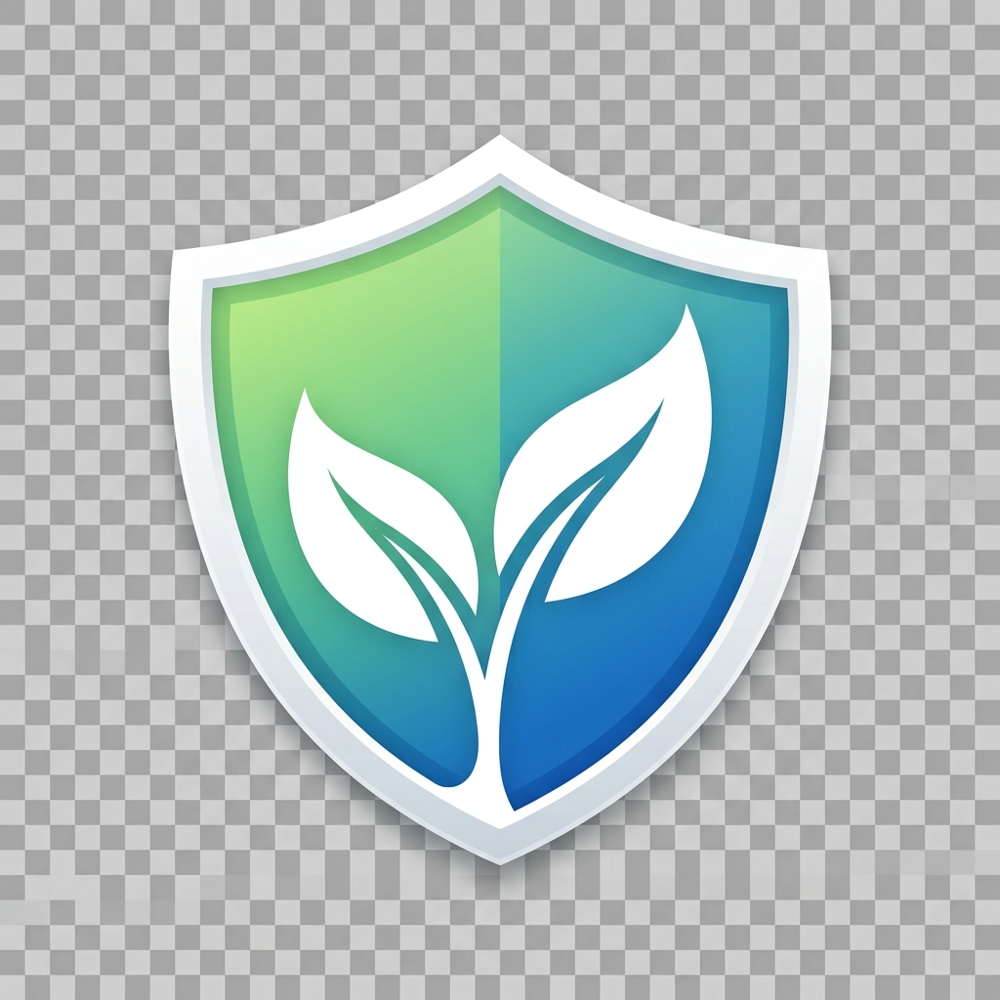
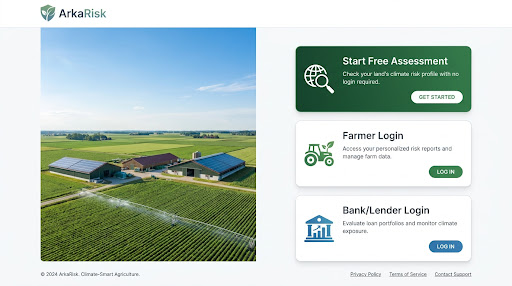
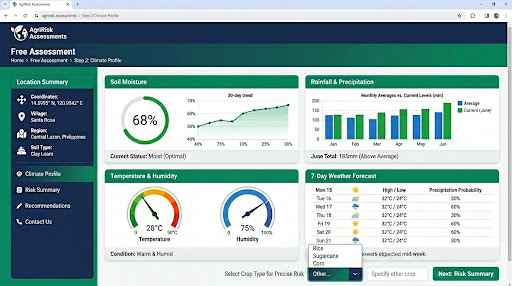
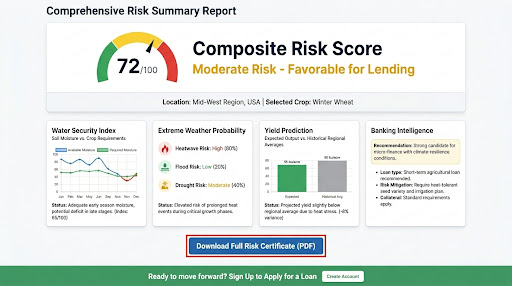

<div align="center">
  
  <h1>ArkaRisk</h1>
  <p><strong>Next-Gen Climate Resilience & Lending Intelligence for Smallholder Farmers</strong></p>

  [](https://opensource.org/licenses/MIT)
  [](https://reactjs.org/)
  [](https://vitejs.dev/)
  [](https://nodejs.org/)
</div>

---

## 🌍 The Vision

ArkaRisk bridges the gap between climate science and fintech. We empower smallholder farmers with real-time climate risk assessments while providing lenders with the data-driven intelligence needed to offer accessible micro-finance.

<div align="center">
  
</div>

## ✨ Key Features

- **🛡️ Shielded Assessments**: Instant climate risk profiling using location-based satellite and soil data.
- **📊 Farmer Dashboard**: Personal portal for tracking farm health, risk scores, and loan statuses.
- **🏦 Lender Intelligence**: A dedicated dashboard for financial institutions to evaluate portfolios and monitor climate exposure.
- **📄 Professional Reports**: Generate and download high-fidelity PDF risk certificates for loan applications.
- **🌱 Soil-to-Sky Data**: Integration of soil classification and 7-day weather forecasting for precise risk coefficients.

---

## 📸 Dashboard Previews

<div align="center">
  <p><strong>Step 2: Climate & Soil Profile</strong></p>
  
  <br/><br/>
  <p><strong>Step 3: Composite Risk Score & Recommendation</strong></p>
  
</div>

---

## 🚀 Getting Started

### Prerequisites
- Node.js (v18+)
- npm or yarn

### Installation

1. **Clone the repository**
   ```bash
   git clone https://github.com/your-username/arkarisk-ai.git
   cd arkarisk-ai
   ```

2. **Install dependencies**
   ```bash
   npm install
   ```

### Running the Project

Run the development server:
```bash
npm run dev
```

The application will be available at `http://localhost:5173`.

---

## 🛠️ Tech Stack

- **Frontend**: React 19, Vite, Lucide React, Chart.js, Leaflet.
- **Styling**: Premium Vanilla CSS (Glassmorphism, Modern Gradients).
- **Mock API**: Fully serverless simulation (Zero backend dependencies).
- **Auth**: Virtual OTP & Dashboard persistence via `localStorage`.

---

## 📄 License
This project is licensed under the MIT License - see the [LICENSE](LICENSE) file for details.

<div align="center">
  <p>Built with ❤️ by the ArkaRisk Team</p>
</div>
